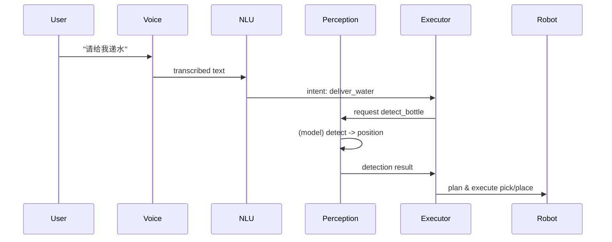

# Architecture overview for robot AI stack

This document describes the high-level architecture, data flows, and responsibilities of
major components introduced in this PR.

- robot_ai_interfaces: ROS2 message definitions used by perception/executor/planning
- robot_perception: perception nodes (Python) providing services and topics
- robot_ai: C++ lifecycle node(s) and an optional ONNX wrapper (compile-time opt-in)
- robot_executor: simple executor that receives perception outputs and runs task FSMs

Mermaid sequence (high-level):

Notes:
- ModelManager implements dynamic loading of ONNX models at runtime and
  falls back to a stub when onnxruntime is not available.
- C++ ONNX integration is optional (ENABLE_ONNXRUNTIME) to avoid forcing heavy
  build dependencies on CI.
