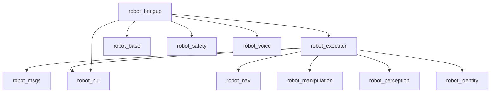
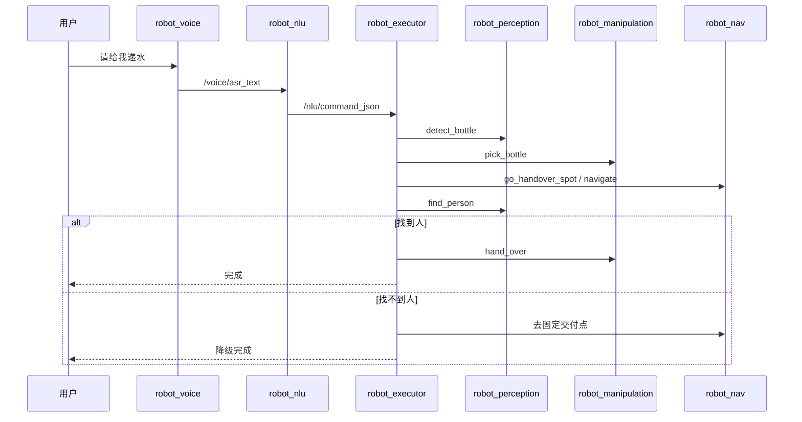
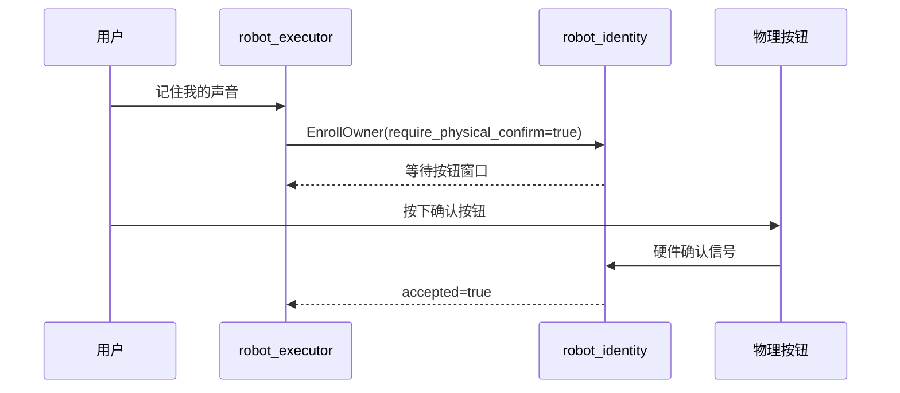

# 面向初学者的系统说明（ROS2 家庭递水机器人）

> 目标读者：高中生。你可以把这个项目想成“很多小程序协作完成一次递水任务”。

## 1. 项目在做什么

这个仓库实现了一个 `deliver_water`（递水）任务骨架：
1. 听懂人话（语音 -> 文本 -> 命令）
2. 找瓶子、抓瓶子
3. 导航到人附近
4. 找到人并递过去
5. 失败时走降级路径（去固定交付点）

代码位置：`/home/runner/work/robot/robot/ros_ws/src`

---

## 2. 包（ROS2 package）总览

| 包名 | 目录 | 作用 | 主要入口 |
|---|---|---|---|
| robot_msgs | `ros_ws/src/robot_msgs` | 自定义消息/服务/动作类型 | 无可执行节点（接口包） |
| robot_base | `ros_ws/src/robot_base` | 底盘驱动骨架、里程计、超时刹车 | `base_driver_node` |
| robot_safety | `ros_ws/src/robot_safety` | 急停与速度限幅 | `safety_node` |
| robot_voice | `ros_ws/src/robot_voice` | 语音桥接（占位） | `voice_bridge_node` |
| robot_nlu | `ros_ws/src/robot_nlu` | 文本转意图 JSON（规则优先） | `nlu_node` |
| robot_identity | `ros_ws/src/robot_identity` | owner/guest 权限与首次绑定门控 | `identity_node` |
| robot_perception | `ros_ws/src/robot_perception` | Python 感知服务骨架（瓶子/找人） | `perception_node`（console_scripts） |
| robot_nav | `ros_ws/src/robot_nav` | 地点库加载与导航服务骨架 | `nav_server_node` |
| robot_manipulation | `ros_ws/src/robot_manipulation` | 机械臂抓取/递交服务骨架 | `manipulation_node` |
| robot_executor | `ros_ws/src/robot_executor` | 任务状态机（流程总调度） | `executor_node` |
| robot_bringup | `ros_ws/src/robot_bringup` | Launch 启动编排与配置 | `dev_mode.launch.py` / `nav_mode.launch.py` |

---

## 3. 每个包怎么运行（入口与命令）

先构建一次：

```bash
cd /home/runner/work/robot/robot/ros_ws
source /opt/ros/humble/setup.bash
colcon build --symlink-install
source install/setup.bash
```

单节点运行示例：

```bash
ros2 run robot_base base_driver_node
ros2 run robot_safety safety_node
ros2 run robot_voice voice_bridge_node
ros2 run robot_nlu nlu_node
ros2 run robot_identity identity_node
ros2 run robot_nav nav_server_node
ros2 run robot_manipulation manipulation_node
ros2 run robot_executor executor_node
ros2 run robot_perception perception_node
```

整套启动：

```bash
ros2 launch robot_bringup dev_mode.launch.py
ros2 launch robot_bringup nav_mode.launch.py
```

---

## 4. 文件地图（高层解释，不贴源码）

### 4.1 通用构建文件（每个包都有）
- `package.xml`：包元数据和依赖清单。
- `CMakeLists.txt`（C++ 包）或 `setup.py`（Python 包）：告诉 colcon 怎么编译、安装、注册可执行入口。

### 4.2 各包关键文件

#### robot_msgs
- `srv/DetectObject.srv`：定义“找物体”请求/响应字段。
- `srv/FindPerson.srv`：定义“找人”服务字段。
- `srv/EnrollOwner.srv`：定义 owner 绑定服务字段。
- `action/PickBottle.action`、`action/HandOver.action`：预留动作接口。

#### robot_base
- `include/robot_base/serial_interface.hpp`：串口接口抽象。
- `include/robot_base/safety_utils.hpp`：超时刹车函数声明。
- `src/serial_interface_stub.cpp`：串口占位实现（无硬件也能跑）。
- `src/safety_utils.cpp`：超时时把速度清零。
- `src/base_driver_node.cpp`：订阅 `/cmd_vel`，发布 `/odom` `/estop`。
- `test/test_timeout_brake.cpp`：测试超时刹车逻辑。

#### robot_safety
- `src/safety_node.cpp`：订阅 `/cmd_vel_raw` 与 `/estop`，输出限速后的 `/cmd_vel`。

#### robot_voice
- `src/voice_bridge_node.cpp`：把 `/voice/raw_text` 转发到 `/voice/asr_text`。

#### robot_nlu
- `include/robot_nlu/nlu_parser.hpp`：解析接口声明。
- `src/nlu_parser.cpp`：规则匹配中文命令并输出 JSON。
- `src/nlu_node.cpp`：订阅 ASR 文本并发布 NLU JSON。
- `test/test_nlu_parser.cpp`：NLU 单元测试。

#### robot_identity
- `include/robot_identity/enroll_policy.hpp`：绑定门控策略声明。
- `src/enroll_policy.cpp`：首次绑定是否允许的策略实现。
- `src/identity_node.cpp`：服务 `/identity/enroll_owner` 与角色发布。
- `test/test_enroll_gating.cpp`：门控策略测试。

#### robot_perception
- `robot_perception/perception_node.py`：相机订阅 + `detect_bottle`/`find_person` 服务骨架。
- `setup.py`：`perception_node` console_scripts 入口注册。

#### robot_nav
- `include/robot_nav/location_manager.hpp`：地点结构与管理器声明。
- `src/location_manager.cpp`：解析 `locations.yaml`。
- `src/nav_server_node.cpp`：提供 `/nav/go_handover_spot` 服务。
- `test/test_location_manager.cpp`：地点解析测试。

#### robot_manipulation
- `src/manipulation_node.cpp`：抓取与递交服务占位实现。

#### robot_executor
- `src/executor_node.cpp`：主状态机（IDLE -> SEARCH_BOTTLE -> ...）。

#### robot_bringup
- `launch/dev_mode.launch.py`：开发模式（stub/sim 默认开启）。
- `launch/nav_mode.launch.py`：导航模式。
- `test/dev_mode.launch.test.py`：bringup 集成测试。
- `config/bringup.yaml`：关键参数默认值。
- `config/locations.yaml`：家庭地点坐标。
- `config/nav2_params.yaml`、`slam_params.yaml`：导航/建图参数模板。
- `config/search_areas.yaml`：全局搜索区域模板。

#### CI 与脚本
- `.github/workflows/ros2-ci.yml`：GitHub Actions 构建 + 测试流水线。
- `tools/sim_tests/run_sim_smoke.sh`：无硬件烟雾测试。
- `tools/hw_smoke_tests/run_hw_smoke.sh`：硬件联调入口。

---

## 5. 系统架构（层次与职责）

1. **设备层**：底盘、雷达、深度相机、机械臂、按钮。
2. **驱动与安全层**：`robot_base`、`robot_safety`。
3. **理解与决策层**：`robot_voice`、`robot_nlu`、`robot_identity`、`robot_executor`。
4. **执行层**：`robot_perception`、`robot_nav`、`robot_manipulation`。
5. **编排层**：`robot_bringup`。

### 模块交互图

```mermaid
flowchart LR
  Voice[robot_voice] --> NLU[robot_nlu]
  NLU --> Exec[robot_executor]
  Exec --> Identity[robot_identity]
  Exec --> Perception[robot_perception]
  Exec --> Nav[robot_nav]
  Exec --> Manip[robot_manipulation]
  Exec --> Safety[robot_safety]
  Safety --> Base[robot_base]
  Base --> Odom[/odom + /estop]
```

### 包依赖示意图（简化）



---

## 6. 关键流程时序图

### 6.1 递水流程（含降级）



### 6.2 首次 owner 绑定（物理确认）



---

## 7. 硬件文档（假设、接口、安全、接线、检查单）

### 假设硬件
- 上位机：Ubuntu 22.04 + ROS2 Humble。
- 下位机：STM32（串口协议）。
- 传感器：RPLIDAR、RealSense D435/D435i。
- 执行器：差速底盘 + 可拆机械臂。

### 接口说明（高层）
- 串口：上位机给速度指令，下位机回传编码器/急停状态。
- 相机：发布 RGB、深度、相机内参。
- 按钮：急停按钮 + owner 首绑确认按钮。

### 安全约束
- 急停优先级最高：急停触发时速度必须归零。
- 通信超时刹车：默认 `cmd_timeout_ms=200`。
- 首次 owner 绑定默认必须物理确认（防止误绑定）。
- 速度上限默认 `max_linear=0.35`、`max_angular=1.0`。

### 接线/连接建议（最小清单）
1. 电池 -> 电源管理 -> 上位机/下位机/驱动板分路供电。
2. 上位机 USB/串口 -> STM32。
3. 雷达 USB/串口 -> 上位机。
4. RealSense USB3 -> 上位机。
5. 急停按钮接到下位机硬件中断或安全回路。
6. owner 绑定按钮接到可读 GPIO（由 identity 策略读取）。

### 运行前检查单（Runtime Checklist）
- [ ] 急停按钮可触发并恢复。
- [ ] 串口设备号正确、波特率正确。
- [ ] 雷达和相机都在 ROS 里有数据。
- [ ] `dev_mode.launch.py` 能全部起节点。
- [ ] `/nlu/command_json`、`/robot/state` 有消息。
- [ ] 测试时先空旷环境、低速运行。

---

## 8. 测试相关开关（toggle）审计与默认值

| 开关 | 位置 | 当前默认 | 建议是否默认开启 | 说明 |
|---|---|---:|---|---|
| `use_stub` | `robot_base` | `true` | 是 | 没硬件也能开发调试 |
| `sim_mode` | `robot_manipulation` | `true` | 是 | 没机械臂也能联调流程 |
| `owner_enrolled` | `robot_identity` | `false` | 是 | 初始安全状态 |
| `require_button_for_first_enroll` | `robot_identity` | `true` | 是 | 首绑必须物理确认 |
| `cmd_timeout_ms` | `robot_base` | `200` | 是 | 通信超时保护 |

结论：当前默认值对开发者体验和安全性都合理，不需要再打开“临时测试 hack”。

---

## 9. 本地开发、测试与 CI

### 本地构建与测试

```bash
cd /home/runner/work/robot/robot/ros_ws
source /opt/ros/humble/setup.bash
colcon build --event-handlers console_direct+
colcon test --event-handlers console_direct+ --ctest-args -VV --output-on-failure
colcon test-result --verbose
python3 -m py_compile src/robot_perception/robot_perception/perception_node.py
```

### CI 在做什么
- 文件：`.github/workflows/ros2-ci.yml`
- 触发：Pull Request、push 到 `main`
- 环境：`ros:humble-ros-base` 容器
- 步骤：安装依赖 -> `colcon build` -> `colcon test` -> `colcon test-result` -> Python 编译检查

### 如何看 CI 失败
1. 先看失败步骤是 Build 还是 Test。
2. 若是 Test，优先看 `colcon test-result --verbose` 输出的失败包。
3. 常见类型：
   - `ament_cpplint`: 行宽/头文件/版权头问题
   - `ament_uncrustify`: 代码格式问题
   - 单元测试断言失败：功能逻辑问题
4. 修复后本地复现同命令，再推送。

---

## 10. 进一步阅读

- `docs/ARCHITECTURE.md`（架构）
- `docs/INTERFACES.md`（接口）
- `docs/SEQUENCES.md`（更多时序图）
- `docs/TESTPLAN.md`（测试计划）
