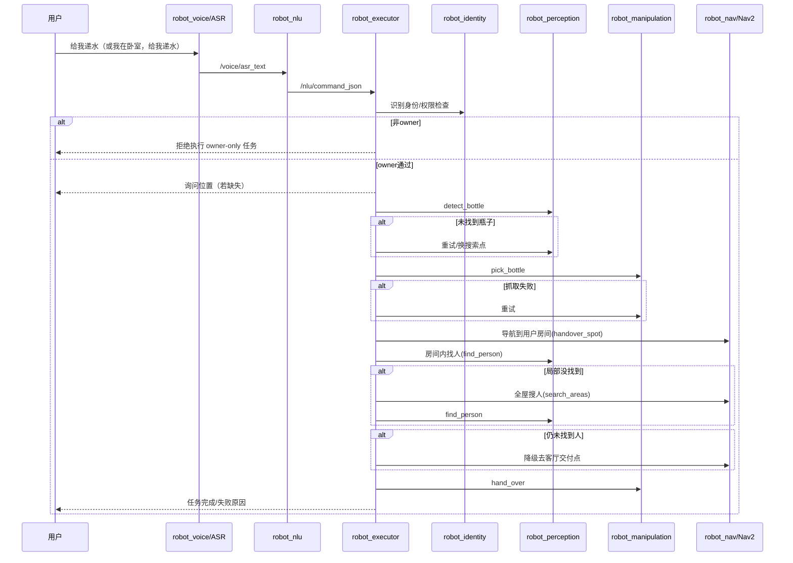
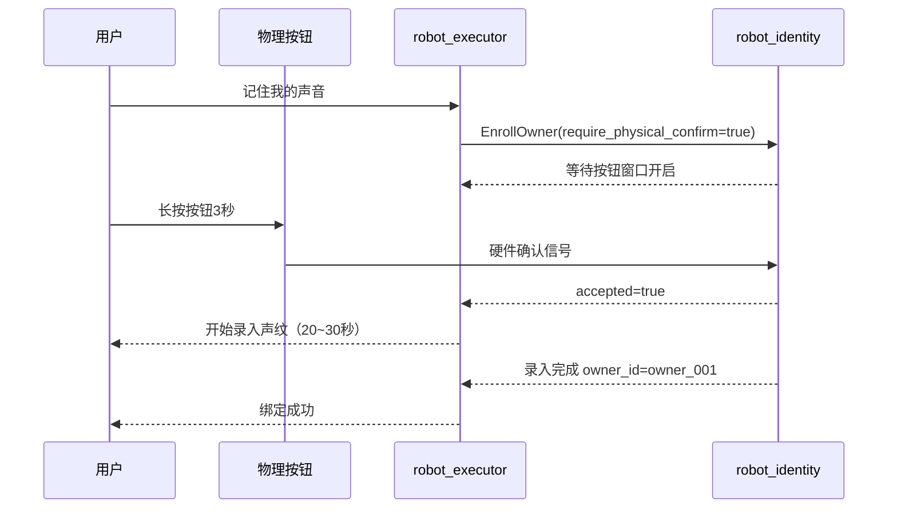

# 关键时序图

## 1) deliver_water（含降级）

```mermaid
sequenceDiagram
    participant U as 用户
    participant V as robot_voice/ASR
    participant N as robot_nlu
    participant E as robot_executor
    participant I as robot_identity
    participant P as robot_perception
    participant M as robot_manipulation
    participant Nav as robot_nav/Nav2

    U->>V: 给我递水（或我在卧室，给我递水）
    V->>N: /voice/asr_text
    N->>E: /nlu/command_json
    E->>I: 识别身份/权限检查
    alt 非owner
        E-->>U: 拒绝执行 owner-only 任务
    else owner通过
        E-->>U: 询问位置（若缺失）
        E->>P: detect_bottle
        alt 未找到瓶子
            E->>P: 重试/换搜索点
        end
        E->>M: pick_bottle
        alt 抓取失败
            E->>M: 重试
        end
        E->>Nav: 导航到用户房间(handover_spot)
        E->>P: 房间内找人(find_person)
        alt 局部没找到
            E->>Nav: 全屋搜人(search_areas)
            E->>P: find_person
        end
        alt 仍未找到人
            E->>Nav: 降级去客厅交付点
        end
        E->>M: hand_over
        E-->>U: 任务完成/失败原因
    end
```

## 2) enroll_owner_voice（物理确认窗口）

```mermaid
sequenceDiagram
    participant U as 用户
    participant B as 物理按钮
    participant E as robot_executor
    participant I as robot_identity

    U->>E: 记住我的声音
    E->>I: EnrollOwner(require_physical_confirm=true)
    I-->>E: 等待按钮窗口开启
    U->>B: 长按按钮3秒
    B->>I: 硬件确认信号
    I-->>E: accepted=true
    E-->>U: 开始录入声纹（20~30秒）
    I-->>E: 录入完成 owner_id=owner_001
    E-->>U: 绑定成功
```
