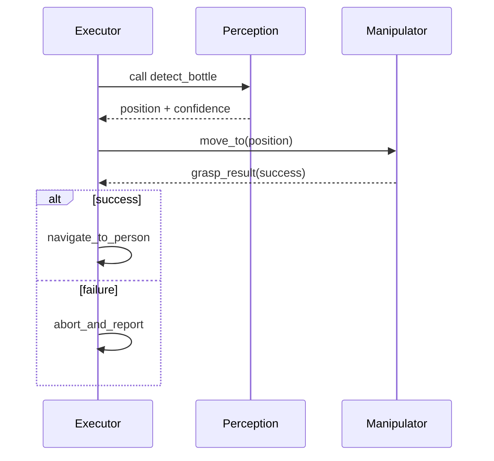

# Sequence diagrams and flow details

This file contains example flows and state transitions used by the executor.

```mermaid
sequenceDiagram
  participant Executor
  participant Perception
  participant Manipulator
  Executor->>Perception: call detect_bottle
  Perception-->>Executor: position + confidence
  Executor->>Manipulator: move_to(position)
  Manipulator-->>Executor: grasp_result(success)
  alt success
    Executor->>Executor: navigate_to_person
  else failure
    Executor->>Executor: abort_and_report
  end
```
